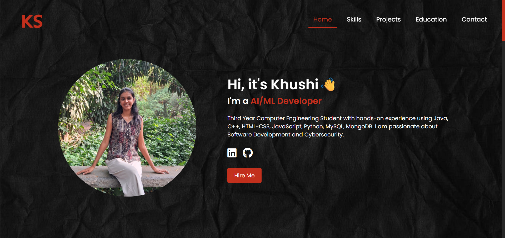
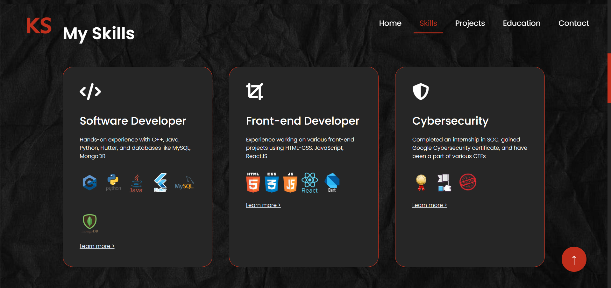
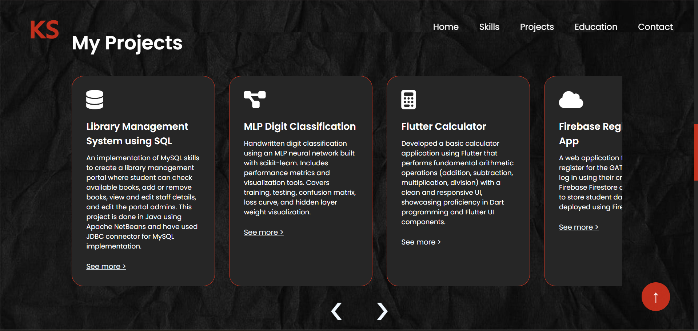
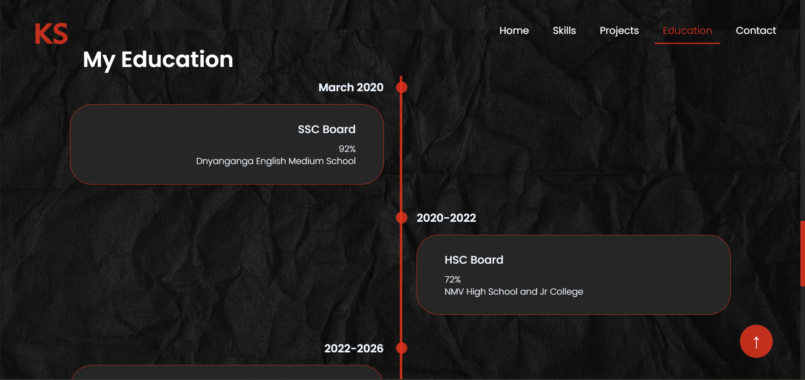
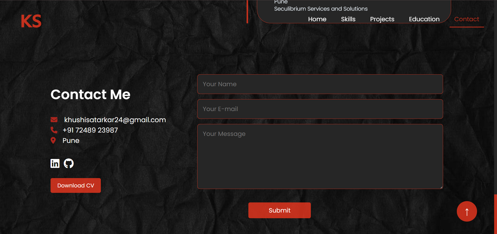

# my-portfolio
 
Welcome to my personal portfolio!

## 📌 Features: 
✔️ Fully Responsive Design

✔️ Smooth Scroll Navigation

✔️ Dynamic Sections (Skills, Projects, Education, Contact)

## 🛠️ Tech Stack: 
Frontend: HTML, CSS, JavaScript

## 📂 Sections: 
🔹 Home: Introduction & Links

🔹 Skills: Technologies & Tools

🔹 Projects: Overview of My Projects

🔹 Education: Academic Background

🔹 Contact: Social Links & Email Form

## 📸 Outputs

### 1. Homepage

*Homepage of my portfolio website*

### 2. My Skills

*Showcases my technical skills and proficiencies*

### 3. My Projects

*A collection of some of my projects with brief descriptions*

### 4. My Education

*My educational background and internships*

### 5. Contact Me

*Contact form for quick reach*

## 📬 Connect with me: 
Feel free to reach out to me at:

📧 khushisatarkar24@gmail.com | 🔗 [LinkedIn ](https://www.linkedin.com/in/khushi-satarkar-039056254/) 
